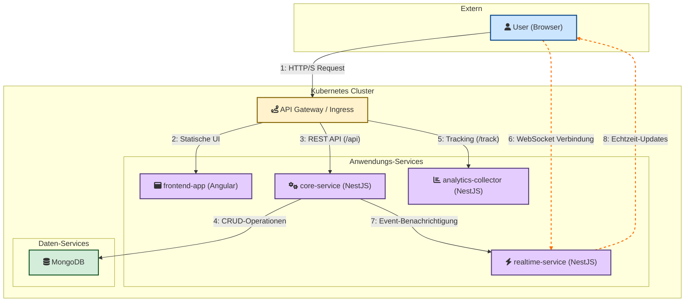

# Real-Time Event Management Plattform

Dieses Projekt ist eine Event-Management-Plattform, die im Rahmen der Vorlesung "Fortgeschrittene Informatik" als verteiltes System mit einer Microservice-Architektur entwickelt wurde. Sie ermöglicht es Benutzern, Events zu erstellen, zu verwalten und Echtzeit-Benachrichtigungen zu erhalten.

**Link zum Repository:** `[Bitte hier den Link zum öffentlichen GitHub-Repository einfügen]`

---

## Inhaltsverzeichnis

- [Technologie-Stack](#technologie-stack)
- [Architektur](#architektur)
- [Voraussetzungen](#voraussetzungen)
- [Ausführung mit Docker Compose (Lokal)](#ausführung-mit-docker-compose-lokal)
- [Deployment auf Kubernetes (Lokal)](#deployment-auf-kubernetes-lokal)
- [Beschreibung der Services](#beschreibung-der-services)

---

## Technologie-Stack

### Frontend
- **Angular**: Ein robustes Framework zur Erstellung von Single-Page-Applications.
- **SCSS**: Für erweiterte und strukturierte Stylesheets.
- **WebSockets (`ws`-Bibliothek)**: Für die Echtzeit-Kommunikation mit dem `realtime-service`.

### Backend
- **Node.js mit NestJS**: Ein progressives Node.js-Framework für den Aufbau effizienter und skalierbarer serverseitiger Anwendungen. Es bietet eine klare Architektur und nutzt TypeScript.
- **MongoDB**: Eine NoSQL-Datenbank zur Speicherung von Event- und Benutzerdaten.
- **REST-API**: Für die Standardkommunikation zwischen dem Frontend und dem `core-service`.

### DevOps
- **Docker & Docker Compose**: Zur Containerisierung der Anwendung und zur einfachen Verwaltung der lokalen Entwicklungsumgebung.
- **Kubernetes (K8s)**: Zur Orchestrierung der containerisierten Services für ein skalierbares und robustes Deployment (getestet mit dem K8s-Cluster von Docker Desktop).
- **Nginx**: Als Webserver innerhalb des Frontend-Containers, um die statischen Angular-Dateien auszuliefern.

---

## Architektur

Das System ist als verteiltes System mit mehreren Microservices aufgebaut, die jeweils eine spezifische Geschäftsfunktion abbilden. Die Kommunikation vom Browser zu den Services wird durch einen Kubernetes Ingress gesteuert.



1.  **Frontend (Angular)**: Die Benutzeroberfläche, die mit den Backend-Services über den Kubernetes Ingress interagiert.
2.  **Core-Service (NestJS)**: Der zentrale Service, der die Hauptgeschäftslogik enthält. Er verwaltet Benutzer, Events und stellt eine REST-API für CRUD-Operationen bereit. Er kommuniziert intern mit dem `realtime-service`.
3.  **Realtime-Service (NestJS)**: Stellt eine WebSocket-Verbindung für Echtzeit-Benachrichtigungen bereit, wenn neue Events erstellt werden.
4.  **Analytics-Collector-Service (NestJS)**: Ein Platzhalter-Service, der Daten über Benutzerinteraktionen entgegennehmen und zur späteren Analyse weiterleiten könnte. Erfüllt die Anforderung von mindestens drei Services.

---

## Voraussetzungen

Stellen Sie sicher, dass die folgenden Werkzeuge auf Ihrem System installiert und lauffähig sind:

- **Docker Desktop**: [Installationsanleitung](https://docs.docker.com/get-docker/)
- **Kubernetes**: Muss in den Einstellungen von Docker Desktop aktiviert sein (`Settings -> Kubernetes -> Enable Kubernetes`).
- **kubectl**: Das Kubernetes-Kommandozeilen-Tool. Wird mit Docker Desktop installiert.
- **git**: Zum Klonen des Repositories.

---

## Ausführung mit Docker Compose (Lokal)

Dies ist der empfohlene Weg, um die Anwendung lokal schnell zu starten und zu testen.

1.  **Repository klonen:**
    ```bash
    git clone https://github.com/segudy/real-time-event-management.git
    cd real-time-event-management
    ```

2.  **Docker-Images bauen:**
    Stellen Sie sicher, dass Docker Desktop läuft. Führen Sie die folgenden Befehle im Hauptverzeichnis des Projekts aus, um die Images für alle Services zu bauen:
    ```bash
    docker build -t core-service:latest backend/core-service
    docker build -t realtime-service:latest backend/realtime-service
    docker build -t analytics-collector-service:latest backend/analytics-collector-service
    docker build -t frontend-app:latest frontend
    ```

3.  **Anwendung starten:**
    Führen Sie im Hauptverzeichnis den folgenden Befehl aus, um alle Container zu starten:
    ```bash
    docker-compose up -d
    ```
    Der `-d` Parameter startet die Container im Hintergrund.

4.  **Zugriff auf die Anwendung:**
    Die Anwendung ist jetzt unter **[http://localhost:4200](http://localhost:4200)** im Browser erreichbar.

5.  **Anwendung stoppen und aufräumen:**
    ```bash
    docker-compose down
    ```

---

## Deployment auf Kubernetes (Lokal)

Diese Schritte beschreiben das Deployment auf dem lokalen Kubernetes-Cluster, der von Docker Desktop bereitgestellt wird.

1.  **Voraussetzungen erfüllen:**
    * Stellen Sie sicher, dass Kubernetes in Docker Desktop aktiviert und "grün" ist.
    * Stellen Sie sicher, dass alle Docker-Images wie im vorherigen Abschnitt beschrieben lokal gebaut wurden.

2.  **Nginx Ingress Controller installieren (falls noch nicht geschehen):**
    Der Ingress Controller agiert als "Verkehrspolizist" für Anfragen von außerhalb des Clusters.
    ```bash
    kubectl apply -f https://raw.githubusercontent.com/kubernetes/ingress-nginx/controller-v1.10.0/deploy/static/provider/cloud/deploy.yaml
    ```
    *Es kann einen Moment dauern, bis die Ingress-Pods den Status `Running` erreichen.*

3.  **Kubernetes-Manifeste anwenden:**
    Führen Sie den folgenden Befehl aus dem Hauptverzeichnis des Projekts aus. Er wendet alle Konfigurationsdateien im `kubernetes`-Ordner an und erstellt die gesamte Anwendungs-Infrastruktur.
    ```bash
    kubectl apply -f kubernetes/
    ```

4.  **Status überprüfen:**
    Warten Sie, bis alle Pods den Status `Running` haben. Sie können das mit diesem Befehl beobachten:
    ```bash
    kubectl get pods
    ```

5.  **Zugriff auf die Anwendung:**
    Die Anwendung ist jetzt über den Nginx Ingress Controller unter **[http://localhost](http://localhost)** im Browser erreichbar.

6.  **Ressourcen aufräumen:**
    Um alle erstellten Kubernetes-Ressourcen wieder aus dem Cluster zu löschen, führen Sie aus:
    ```bash
    kubectl delete -f kubernetes/
    ```

---

## Beschreibung der Services

-   **`frontend-app`**: Die Angular-Anwendung, die die Benutzeroberfläche darstellt und in einem Nginx-Container ausgeliefert wird.
-   **`core-service`**: Kümmert sich um die Kernfunktionalitäten wie Benutzer- und Event-Management und die Datenbank-Interaktion. Stellt eine REST-API bereit.
-   **`realtime-service`**: Verwaltet WebSocket-Verbindungen für Echtzeit-Benachrichtigungen.
-   **`analytics-collector-service`**: Nimmt Tracking-Events entgegen und gibt sie im Log aus.
-   **`mongo`**: Die MongoDB-Instanz, die als persistente Datenbank für den `core-service` dient.